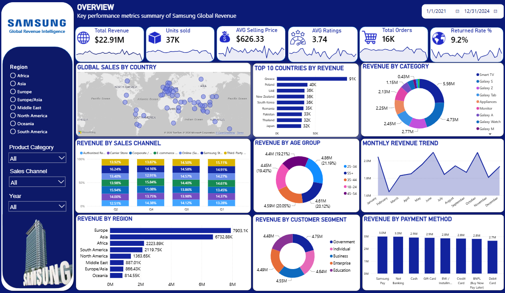

# 📱 Samsung Global Revenue Intelligence | Power BI

<p align="center">
  
</p>

## 📖 Project Overview

Samsung Global Revenue Intelligence is an interactive Power BI dashboard designed to analyze Samsung's worldwide revenue performance from **2021–2024**. The dashboard transforms raw business data into meaningful insights, enabling stakeholders to monitor revenue trends, customer behavior, regional performance, product contribution, and business growth through dynamic visualizations.

The report combines KPI monitoring, geographical analysis, customer segmentation, sales channel comparison, payment analysis, and interactive filtering to support data-driven business decisions.

---

# 🎯 Business Objective

The primary objective of this dashboard is to provide a centralized business intelligence solution that enables decision-makers to:

- Monitor global revenue performance
- Identify high-performing countries and regions
- Analyze customer purchasing behavior
- Compare revenue across product categories
- Track monthly revenue trends
- Evaluate payment preferences
- Monitor return rate and customer satisfaction
- Support strategic business decisions using interactive analytics

---

# 📊 Key Performance Indicators (KPIs)

| KPI | Description |
|------|-------------|
| 💰 Total Revenue | Overall revenue generated |
| 📦 Units Sold | Total number of units sold |
| 💵 Average Selling Price | Average product selling price |
| ⭐ Average Customer Rating | Customer satisfaction score |
| 🛒 Total Orders | Total completed orders |
| 🔄 Return Rate | Percentage of returned orders |

---

# 📈 Dashboard Features

## 🌍 Global Revenue Analysis

- Interactive World Map
- Country-wise Revenue Distribution
- Top 10 Countries by Revenue
- Region-wise Revenue Analysis

---

## 📱 Product Analysis

- Revenue by Product Category
- Product Contribution Analysis
- Category Comparison

---

## 👥 Customer Analysis

- Revenue by Customer Age Group
- Revenue by Customer Segment
- Customer Purchasing Behavior

---

## 🛍 Revenue by Sales Channel

Compare revenue generated through:

- Authorized Retailers
- Corporate Sales
- E-commerce
- Samsung Store
- Online Store
- Third-Party Retailers

---

## 💳 Payment Method Analysis

Revenue comparison across different payment methods:

- Samsung Pay
- Net Banking
- Cash
- Gift Card
- EMI
- Credit Card
- Debit Card
- BNPL (Buy Now Pay Later)

---

## 📅 Monthly Revenue Trend

Track revenue growth across all months to identify:

- Seasonal trends
- Revenue fluctuations
- Growth patterns

---

# 🎛 Interactive Filters

Users can dynamically filter the dashboard by:

- 🌎 Region
- 📱 Product Category
- 🛍 Sales Channel
- 📅 Year
- 📆 Date Range

---

# 🛠 Tools & Technologies

- Microsoft Power BI
- Power Query
- DAX (Data Analysis Expressions)
- Data Modeling
- Microsoft Excel

---

# 📂 Dataset Information

The dataset contains Samsung's global business transactions, including:

- Order Details
- Revenue
- Product Category
- Country
- Region
- Customer Segment
- Customer Age Group
- Payment Method
- Sales Channel
- Product Rating
- Return Status
- Order Date

---

# 📊 Dashboard Insights

This dashboard helps identify:

- Highest revenue-generating countries
- Best-performing product categories
- Regional revenue contribution
- Customer demographics
- Monthly revenue trends
- Preferred payment methods
- Sales channel effectiveness
- Customer satisfaction levels
- Return rate analysis

---

# 📸 Dashboard Preview

<p align="center">
  
</p>

---

# 📁 Repository Structure

```
Samsung-Global-Revenue-Analytics
│
├── Dashboard.pbix
├── Dashboard.png
├── samsung_global_revenue_dataset.csv
├── README.md
└── LICENSE
```

---

# 🚀 How to Use

1. Clone this repository.
2. Open the `.pbix` file using Microsoft Power BI Desktop.
3. Explore the interactive dashboard.
4. Apply filters to analyze different business perspectives.
5. Review insights for better decision-making.

---

# 📌 Project Highlights

✅ Interactive Dashboard

✅ Dynamic KPI Cards

✅ DAX Measures

✅ Power Query Data Transformation

✅ Data Modeling

✅ Geographical Analysis

✅ Customer Segmentation

✅ Revenue Trend Analysis

✅ Responsive Visualizations

---

# 🎯 Skills Demonstrated

- Business Intelligence
- Data Visualization
- Data Cleaning
- Data Transformation
- Dashboard Design
- DAX Calculations
- Power Query
- Data Modeling
- Analytical Thinking
- Business Analysis

---

# 📧 Connect With Me

**Dhruv Kohli**

💼 Aspiring Data Analyst

- GitHub: https://github.com/Dhruv-Kohli
- LinkedIn: https://linkedin.com/in/dhruv-kohlii

---

## ⭐ If you found this project useful, don't forget to Star this repository!

Thank you for visiting my project! 🚀
